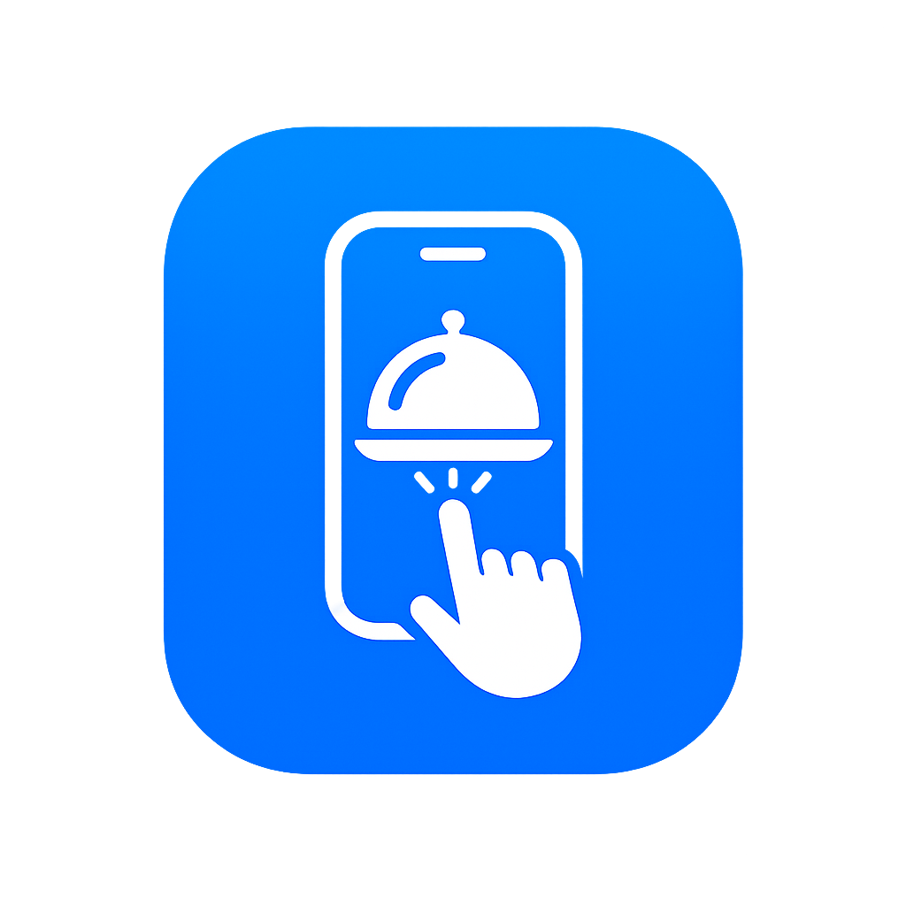

# OrderNow



A modern web application for managing restaurants, tables, menus, and orders through an administrative panel, with support for generating QR codes that allow customers to access the restaurant menu quickly.

## 📋 Table of Contents

- [Features](#-features)
- [Tech Stack](#-tech-stack)
- [Prerequisites](#-prerequisites)
- [Installation](#-installation)
- [Getting Started](#-getting-started)
- [Environment Configuration](#-environment-configuration)
- [Project Structure](#-project-structure)
- [How It Works](#-how-it-works)
- [Development](#-development)
- [License](#-license)

## ✨ Features

- Restaurant management from the main dashboard
- Authentication and role-based access control
- Category and dish administration
- Restaurant table listing and management
- QR code generation per table for quick customer access
- PDF export of QR codes for printing
- Order management and account status tracking
- Admin panel for staff and managers
- Responsive interface for desktop and mobile devices
- Angular 22 + TypeScript architecture

## 🛠️ Tech Stack

- Angular 22
- TypeScript
- RxJS
- Angular Router
- Tailwind CSS
- Angularx QR Code
- jsPDF
- pnpm
- Vitest

## 📋 Prerequisites

Before you begin, make sure you have installed:

- Node.js v20 or higher
- pnpm v9 or higher
- An OrderNow backend running on the REST API

## 🚀 Installation

1. Clone the repository:

```bash
git clone <repository-url>
cd OrderNow
```

2. Install dependencies:

```bash
pnpm install
```

3. Make sure the backend is available at the URL configured in the app.

## 🎯 Getting Started

### Start the development server

```bash
pnpm start
```

The project will be available at:

```text
http://localhost:4200
```

### Build for production

```bash
pnpm run build
```

### Run tests

```bash
pnpm test
```

## ⚙️ Environment Configuration

The app uses environment values defined in:

- src/environments/environment.ts
- src/environments/environment.development.ts

The main variables currently configured are:

```ts
export const environment = {
  URL_BASE: "http://localhost:8080/api/",
  FRONTEND_URL: "http://localhost:5173/"
};
```

> The API backend must be running at the configured URL for authentication, dishes, tables, and orders to work correctly.

## 📁 Project Structure

```text
src/
├── app/
│   ├── components/
│   │   ├── atoms/
│   │   ├── dialogs/
│   │   ├── layouts/
│   │   ├── molecules/
│   │   └── organisms/
│   ├── enums/
│   ├── guards/
│   ├── interceptors/
│   ├── interfaces/
│   ├── pages/
│   ├── resolvers/
│   ├── services/
│   ├── app.config.ts
│   ├── app.css
│   ├── app.html
│   ├── app.routes.ts
│   └── app.ts
├── environments/
├── index.html
├── main.ts
└── styles.css
```

## 🔄 How It Works

### For the restaurant

1. The administrator logs into the application.
2. Configures the restaurant and general information.
3. Manages menu categories and dishes.
4. Creates and organizes the restaurant tables.
5. Generates QR codes associated with each table.
6. Controls orders, table status, and service flow.

### For customers

1. The customer scans a table QR code.
2. Accesses the restaurant menu.
3. Selects dishes and places an order.
4. Staff can manage and respond to the order from the admin panel.

### Roles and access

The app includes protected routes with guards to restrict access based on user type:

- Public authentication for login
- Restricted access for authenticated users
- Special access for managers

## 💻 Development

### Main commands

| Command | Description |
|---------|-------------|
| `pnpm start` | Starts the app in development mode |
| `pnpm run build` | Builds the application for production |
| `pnpm test` | Runs the project tests |
| `pnpm run watch` | Builds in watch mode |

### Key modules

- `auth`: login and authentication
- `management`: restaurant administration
- `dishes`: dish and category management
- `tables`: table and QR code management
- `workers`: staff management
- `services`: API communication and global logic

## 🤝 Contributing

Contributions are welcome. If you'd like to collaborate:

1. Fork the project.
2. Create a branch for your change.
3. Make the necessary updates and verify everything works.
4. Open a pull request with a clear description.

## 📄 License

This project is licensed under the CC BY-NC 4.0 license.

For the full legal text, visit: https://creativecommons.org/licenses/by-nc/4.0/legalcode

---

Built to streamline restaurant order management and improve the customer experience through a modern and scalable solution.

